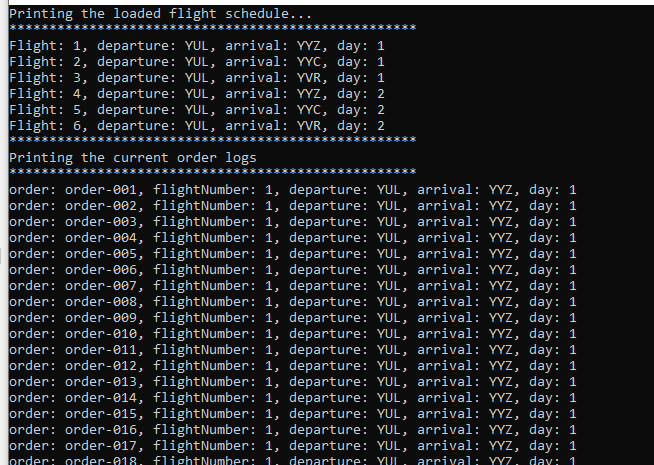

# Coding Exercise

This repository contains a coding exercise with the following structure:

- `Program.cs`: Main entry point of the program.
- `Models`: Directory containing all models used in the program.
- `Data File`: Stored in the `bin` folder.

 `Expected output:`
 
 
